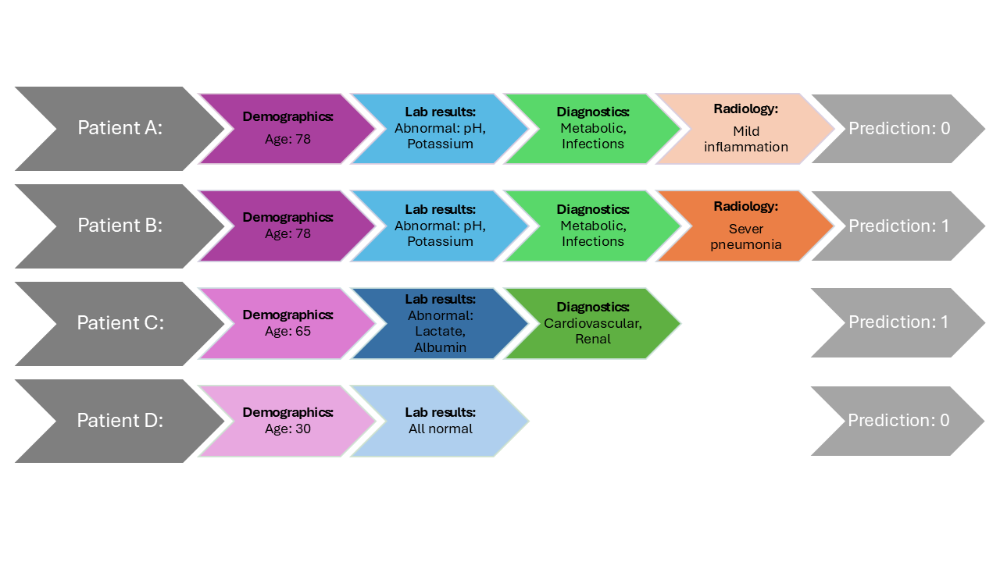

# **PCAFE**

**PCAFE** is a Python library designed for feature selection (FS) in electronic health record (EHR) datasets.

## **Key Contributions**

## **Personalized Cost-Aware Feature Selection (FS):**  
  A novel method tailored for EHR datasets, addressing challenges such as:  
  - Multiple data modalities  
  - Missing values  
  - Cost-aware decision-making
  - Personalized and Iterative FS 

## **Building Benchmarks**

To generate the benchmark datasets:  
- **MIMIC-III Numeric**  
- **MIMIC-III with Costs**  
- **MIMIC-III Multi-Modal Dataset**  
- **eICU Dataset**
Navigate to the **`Dataset_Creation`** directory for instructions.

> **Important:**  
> The MIMIC-III data itself is not provided. You must acquire the data independently from [MIMIC-III on PhysioNet](https://mimic.physionet.org/).

## **Running the Code**

1. Dataset Configuration

Open `embedder_guesser.py` and choose your dataset by modifying the `--data` argument or the `FLAG` section.

Supported datasets:
- `pcafe_utils.load_time_Series()` – eICU time series data
- `pcafe_utils.load_mimic_text()` – MIMIC-III multimodal data (includes clinical text)
- `pcafe_utils.load_mimic_time_series()` – MIMIC-III numeric time series

Also, define the feature acquisition costs by setting `self.cost_list` in the `MultimodalGuesser` class.

2. Running the embedder_guesser Module

3. For the DDQN agent run **`main_robust.py`**
  for other agent run **`main_sb3.py`** and choose the RL agent.

 As shown in the Figure,  P-CAFE iteratively selects features in stages, personalizing the FS process to individual cases. It integrates demographic, laboratory, categorical, and textual data iteratively.